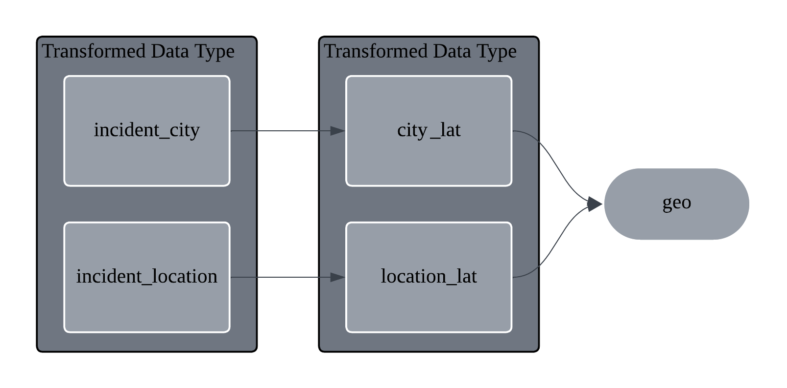
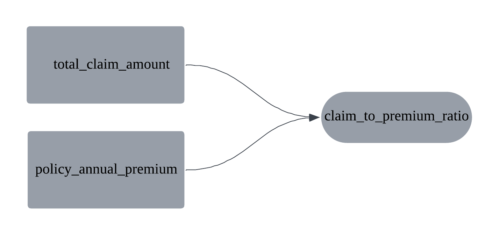
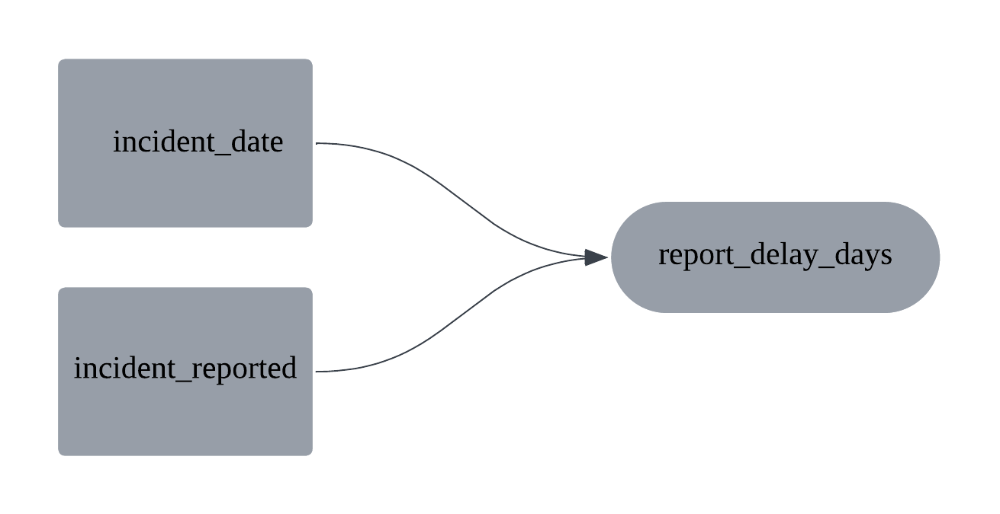

<div align="center">
  <h1>Motor Insurance Fraud Detection</h1>
  <p>End-to-end ML system to score motor insurance claims for fraud risk.</p>
  <a href="https://www.python.org/"></a>
  <a href="https://scikit-learn.org/"></a>
  <a href="https://www.kaggle.com/datasets/buntyshah/auto-insurance-claims-data"></a>
</div>

> [!NOTE]
> Built for a fraud analytics assessment using the Kaggle's dataset and aligned with the IJCA paper [Njeru et al., 2025](https://www.ijcaonline.org/archives/volume187/number65/njeru-2025-ijca-926105.pdf).

---

## Overview
Fraudulent motor claims (Own Damage and Third-Party Bodily Injury) are rare and costly. This project trains multiple classifiers, handles imbalance with SMOTE and class weights, calibrates probabilities, and surfaces explainability (SHAP) plus simple rule flags to support investigators.

## Data
- Source: Kaggle Auto Insurance Claims ([link](https://www.kaggle.com/datasets/buntyshah/auto-insurance-claims-data))
- Target: `fraud_reported` (yes/no)
- Scope: policyholder, policy, incident, vehicle, injury/property/vehicle claim amounts, police report availability
- Synthetic dataset; missing values treated as signal, not noise

## Research alignment
- Reimplemented with supervised learning under imbalance, SMOTE, and tree-based models.
- Added calibrated probabilities, richer feature engineering, top-k metrics, and SHAP explainability can be found in `/models`.

## Features (engineered in `src/preprocess.py`)
- Temporal/behavioral: `report_delay_days`, `policy_tenure_years`, `claims_per_year`
- Financial ratios: `claim_to_premium_ratio`, injury/property/vehicle claim shares, `repair_to_value_ratio`
- Missingness flags: `police_report_missing_flag`, `property_damage_missing_flag`
- Geo/time: `incident_state`, `time_of_day_bucket`, `is_weekend`
- Cleaning: safe coercion of dates/numerics, high-cardinality ID drops (`policy_number`, `insured_zip`, `incident_location`)

### Feature Engineering Suggestions
1. Geo enrichment: map `incident_city` and `incident_location` to latitude proxies (`city_lat`, `location_lat`) and combine them into a single geo signal to capture regional risk patterns.

> [!TIP]
> `city_lat`: Sepang [2.7940744366069867, 101.67145691752741], `location_lat`: Kulim [5.347953273841229, 100.56212257521749]
Fraudsters often plan a staged accident far away from home when the distance shows unusual travel distance proportionally. Question arise to why did the customer travel 385km for an accident?

2. Claim efficiency: compare `total_claim_amount` to `policy_annual_premium` via `claim_to_premium_ratio` to flag claims that are unusually large relative to the premium paid.

Claim efficiency compares how much you claim versus how much you pay in premiums. We divide the claim amount by the annual premium to get a ratio.

| Ratio | Simple Explanation | Risk Level |
|-------|-------------------|------------|
| 0.5 | "You claimed half of what you paid - very normal" | Very Low |
| 1.0 | "You claimed exactly what you paid - break even" | Low |
| 2.0 | "You claimed double what you paid - we need to review" | Medium |
| 5.0 | "You claimed five times what you paid - very suspicious" | High |
| 10.0 | "You claimed ten times what you paid - likely fraud" | Critical |

3. Reporting timeliness: compute `report_delay_days` from `incident_date` and `incident_reported` to capture lag risk—long delays can correlate with higher fraud likelihood.

> [!TIP]
> `report_delay_days` can often be considered one of the strongest predictors of claim fraud. The customers had the time to make witness forget about the details, fabricate evidence, make up stories as supposed to genuine urgency as a sign for needing help.

| Report Delay | Fraud Risk | Risk Multiplier | Typical Scenario |
|--------------|------------|-----------------|------------------|
| 0-1 days | **Low** | 1x (baseline) | Genuine accidents, immediate reporting |
| 2-7 days | **Medium** | 1.5x | Minor incidents, busy customer |
| 8-30 days | **High** | 3x | Red flag: Unusual delay without clear reason |
| 31-90 days | **Very High** | 5x | Staged/fabricated claims |
| 90+ days | **Extreme** | 7x | Policy abuse |

## Quickstart
```bash
pip install -r requirements.txt
python src/train.py         
python src/evaluate.py      
```

## Inference (batch scoring)
```bash
python src/inference.py --input data/insurance_claims.csv --model XGBoost_calibrated
```
- To help with flagging (`late_report`, `high_claim_to_premium`, `missing_police_report`) the pre-processed data from (`models/preprocessors.pkl`) inference can be done to add column on such cases.

## Limitations
- Datasets are based on America region and unsure of the legitimacy.
- Rule flags are simple heuristics thresholds may need tuning for iterative testing and production.